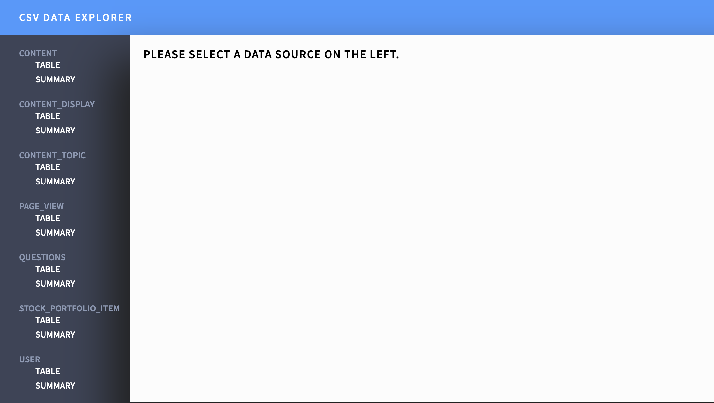

# csv-dat-viewer



CSV viewer that takes a data config like below and allows you to browse the datasets listed in it.

```
[
  {
    "name": "dummy",
    "url": "https://example/content.csv",
    "row_count": 3
  },
]
```

Best used in Chrome 78.0.3904.108 (Official Build) (64-bit)

# Features

- Efficient table viewing for large datasets by keeping DOM small and avoiding garage collection by reusing cells.
- Support for parsing large datasets off-thread in a web worker to keep browser responsive.
- Minimal memory usage for sorting datasets.
- Merge CSS into single `<style>` tag for HTML to reduce latency.

# Dependencies

- Used `papaparse` for CSV parsing (https://www.papaparse.com/)
- `data-ui` for graph rendering (https://github.com/williaster/data-ui)
- `Webpack 4` for bundling JS, CSS and HTML.
- `Babel` for cross browser support
- `React` for rendering UI
- `npm` for package management.

# Running

After checking out the repo, you can use `npm` to get all required deps for doing this. I'd recommend
using `virtualenv` to avoid messing with your global deps.

After running `npm install` or the equivalent, you should be able to run the macros in the `package.json`. Try:

```
npm start
```

for development and

```
npm run build
```

for distribution.

# If I had more time

I'd like to probably add:

- A dynamic way to filter data via a JS `DSL` likely
- More dynamic configuration options for loading individual CSS, etc.

# Troubleshooting

- I've had to clear the cache on my browser given the cache headers on all the files are quite long. Easy way to do this in Chrome is CTRL + SHIFT + R.